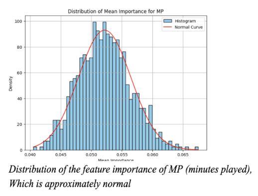
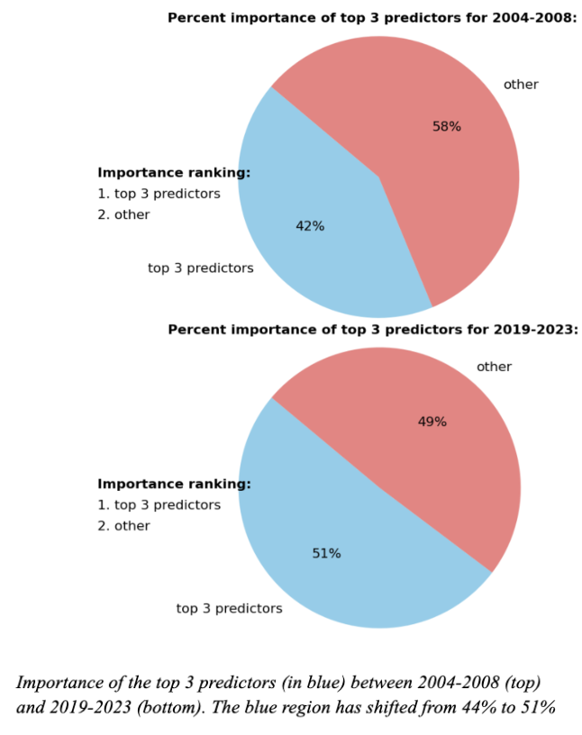
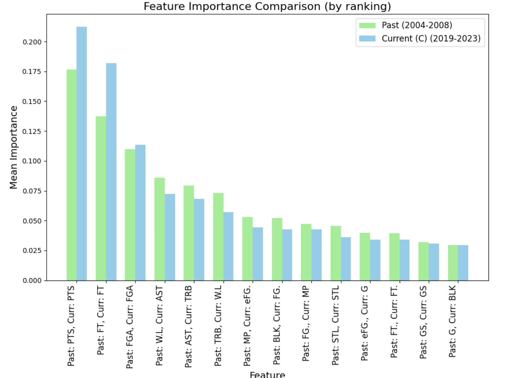
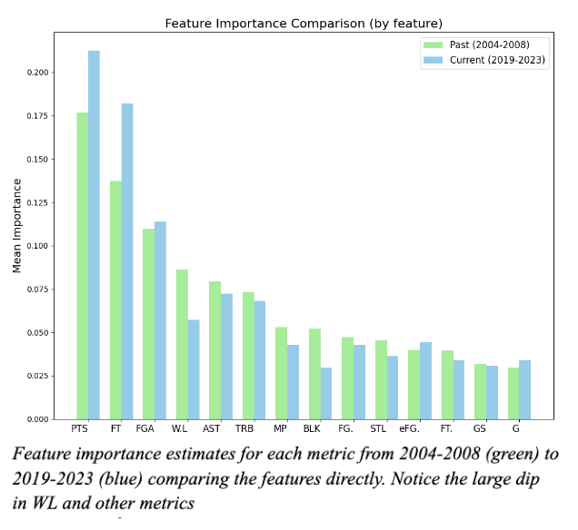

# Exploring Changes in All-NBA Selection Process Between Decades Using Random Forests 
credits: data scraped from NBA website by Matthew Holcomb

Random Forests are typically used in classification tasks by compiling large amounts of decision trees and taking a majority vote on their predictions. However, because our logistic regression model already performed impressively well in predicting All-NBA status, we decided to use random forests primarily as a means of analyzing the changes in All-NBA selection criteria over time rather than as a classification model. Because the All-NBA is the primary way of recognizing great players in basketball, such an analysis of its changing selection criteria reveals insights into the evolving culture of the league and its values. This information would be valuable for any sports historian or hobbyist. 
To do our analysis, we subsetted the main dataset into 2 smaller datasets, one containing player statistics from 2004-2008 and one containing player statistics from 2019-2023. The intuition behind this choice was that we wanted a big enough time gap between our two datasets so that noticeable changes would occur between them.  Both datasets contained over 2,000 observations and will henceforth be referred to as the past and current datasets respectively.

Our primary objective was to fit Random Forest models to both past and current datasets separately, and then extract feature importance estimations using Gini impurity. By comparing the influence of each predictor in determining All-NBA status from the past dataset with its influence in the current dataset, we aimed to identify changes in each metric’s importance over time. However, rather than just fitting a single model for each dataset and comparing them, we opted to take extra steps to ensure all our findings were statistically robust. While we understand the computational drawbacks that accompany the methods that we are about to describe and acknowledge that there are other ways of solving this problem more efficiently, we are highly confident in the statistical accuracy that this process yielded and feel that for our analysis, having results that can withstand statistical scrutiny is most important. 

Firstly, we fit our past and current datasets on 800 random forests with different seeds, each with 200 decision trees. Then we extracted the feature importance for each predictor for each of the decision trees using Gini impurity, which measures the decrease in ambiguity at each node in the tree at which a certain feature is used and compiles it into a percentage of influence that each feature has on the decision-making process of the tree. After getting a matrix of feature importances for each of the 200 trees in a random forest, we took the mean of these estimates. Thus we ended up with an 800 row matrix in which each column represented a different predictor and each row represented a mean estimate of importance for that feature across all trees in a given random forest. The intuition behind doing this was that we wanted to ensure that our distribution was normal to perform significance testing, and the central limit theorem states that a large distribution of sample means will approximate a normal distribution centered at the population mean, regardless of the actual population distribution. Thus by treating each decision tree in a random forest as a sample and then taking the mean of these samples for each of the 800 random forests, we ended up with a distribution of 800 sample means which was approximately normal based on the central limit theorem. 

Although we were not particularly interested in using our random forests as a prediction model, we did verify that each of our random forests, along with each decision tree within the random forests, were performing acceptably well on the test set. This was important because if the trees were inaccurately classifying All-NBA status, then the feature importance weights used by the trees would likely not be reflective of reality. Luckily, all our random forests and individual decision trees scored over 98% on an unseen test set, making the feature importances that we extracted from them highly reliable.

Once we verified that all our distributions of feature importance estimates were approximately normal using histograms, we carried out t-tests to see if there was a significant difference between the mean estimation for the importance of each feature between the past and current dataset at a 95% significance level. Such a finding would indicate very strong statistical evidence that a change has occurred in the importance that feature has in All-NBA selection between the two decades. We also calculated confidence intervals around the means of each feature estimate to have upper and lower bounds for what the true value is likely to be. 

Because all of our standard deviations were almost negligibly small, which is expected given our robust data aggregation process, our confidence intervals around the means were very narrow. Additionally we found significant differences between the past and current estimates for every single metric, all with p-values lower than .001. This indicates very strong evidence that the importance of every single metric used in All-NBA selection has changed at least slightly over time. 

After these initial results, we used graphs to see where the changes were most prominent. We noticed that the influence of the top three metrics, namely points (PT), free throws (FT), and field goals attempted (FGA), has grown significantly between the decades from 42% to 51% collectively, and the importance of the remaining metrics has decreased. This indicates that between 2008 to 2019, the NBA has grown less interested in well-rounded players and more interested in players who score higher in fewer, more important metrics. Additionally, we noticed shifts in the order of importance of metrics. For example, in the past, wins-loss percentage (W.L) was the 4th most important predictor, contributing 9% to the final decision. Now it is the 5th most important predictor behind assists and contributes only 7% to the final
decision.

Altogether, these findings indicate interesting shifts in the culture of the NBA where players are being primarily evaluated based on fewer metrics than they were previously. If these changes continue, we would expect metrics like points and free throws to dominate the selection criteria in coming years and other metrics like blocks to slowly become obsolete. 

